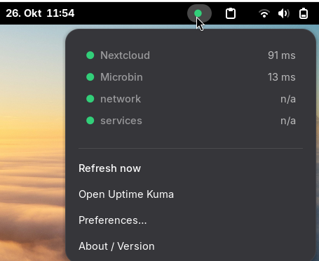
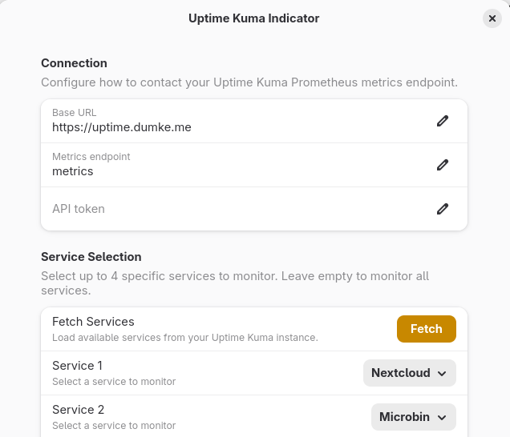

# Uptime Kuma Indicator for GNOME Shell

<div align="center">


**Monitor your [Uptime Kuma](https://github.com/louislam/uptime-kuma) services directly from your GNOME desktop.**

[Features](#-features) • [Installation](#-installation) • [Configuration](#%EF%B8%8F-configuration) • [Screenshots](#-screenshots) • [Contributing](#-contributing)

</div>

---

## 📋 Overview

**Uptime Kuma Indicator** is a lightweight GNOME Shell extension that brings real-time monitoring data from your Uptime Kuma instance directly into your top panel. Stay informed about your services' health without opening a browser.

## ✨ Features

- **🎯 Real-time Monitoring**: Live status updates displayed in your GNOME top panel
- **🎨 Visual Status Indicator**: Colored health dot with textual summary (Up/Down/Total monitors)
- **📊 Detailed Popup**: Scrollable list showing each monitor's status, latency, and last check time
- **🔐 Flexible Authentication**: Support for:
  - Public status page JSON (no authentication)
  - Private REST API (token-based)
  - Prometheus metrics endpoint (API key via Secret Service)
- **⚙️ Highly Configurable**:
  - Customizable refresh intervals
  - Adjustable monitor display limits
  - Toggle latency visibility
  - Normal or compact appearance modes
  - Debug logging levels
- **🌍 Internationalized**: Full localization support (English, German, Swedish, Japanese)
- **🛡️ Robust Error Handling**: Graceful failures with informative tooltips and automatic retry logic
- **🧪 Demo Mode**: Test the UI with mock data before connecting to your instance

## 📦 Requirements

- **GNOME Shell**: Version 46, 47, 48, or 49
- **Dependencies**: GJS with Soup 3 and libadwaita 1.4+
- **Uptime Kuma**: Version 0.10+ with one of:
  - Public status page enabled
  - API access token
  - Prometheus metrics endpoint with authentication

## 🚀 Installation

### From GNOME Extensions Website (Recommended)

Install directly from [extensions.gnome.org](https://extensions.gnome.org/extension/8710/uptime-kuma-indicator/):

1. Visit the [extension page](https://extensions.gnome.org/extension/8710/uptime-kuma-indicator/)
2. Click the **ON/OFF** toggle to install
3. The extension will be automatically downloaded and enabled
4. Configure via the preferences dialog (click the extension icon → settings gear)

### Quick Install from Source

From the project root directory:

```bash
make install
```

Then reload GNOME Shell:
- **Xorg**: Press <kbd>Alt</kbd> + <kbd>F2</kbd>, type `r`, and press <kbd>Enter</kbd>
- **Wayland**: Log out and log back in

Finally, enable the extension:

```bash
gnome-extensions enable uptime-kuma-indicator@uptime.dumke.me
```

### Manual Installation

1. **Copy the extension files**:

   ```bash
   mkdir -p ~/.local/share/gnome-shell/extensions
   cp -r uptime-kuma-indicator ~/.local/share/gnome-shell/extensions/uptime-kuma-indicator@uptime.dumke.me
   ```

2. **Compile the GSettings schema**:

   ```bash
   glib-compile-schemas ~/.local/share/gnome-shell/extensions/uptime-kuma-indicator@uptime.dumke.me/schemas
   ```

3. **Reload GNOME Shell** (see above)

4. **Enable the extension**:
   - Via command line: `gnome-extensions enable uptime-kuma-indicator@uptime.dumke.me`
   - Or use GNOME Extensions app

## ⚙️ Configuration

Access the preferences dialog by clicking the extension icon and selecting the settings gear icon.

### Connection Settings

| Setting | Description |
|---------|-------------|
| **Base URL** | Full URL of your Uptime Kuma instance (e.g., `https://status.example.com`) |
| **API Mode** | Choose your authentication method:<br/>• Status page JSON (public)<br/>• Private API (token)<br/>• Prometheus metrics (API key) |
| **Status Page Slug** | Slug for public status pages (e.g., `status-main`) |
| **API Endpoint** | Relative path for REST API (default: `api/monitor`) |
| **API Token/Key** | Securely stored in Secret Service (never in plain text) |

> **Note:** When using metrics mode the endpoint path is always the default `metrics` route to avoid accidental misconfiguration.

### Display Settings

| Setting | Description |
|---------|-------------|
| **Refresh Interval** | Update frequency in seconds (minimum: 10s) |
| **Maximum Monitors** | Limit number of monitors shown in popup |
| **Show Latency** | Display response times for each monitor |
| **Appearance** | Toggle between normal and compact mode |
| **Demo Data** | Enable test data when no URL is configured |
| **Log Level** | Control logging verbosity (Errors/Info/Debug) |

## 📸 Screenshots

### Panel Indicator


### Settings Dialog


## 🔧 Development

### Setup Development Environment

```bash
# Clone the repository
git clone https://github.com/danst0/gnome-uptime-kuma.git
cd gnome-uptime-kuma

# Work in the extension directory
cd uptime-kuma-indicator

# Compile schemas after making changes
glib-compile-schemas schemas
```

### Testing

```bash
# View extension logs
journalctl -f -o cat /usr/bin/gnome-shell | grep -i "kuma-indicator"

# Test preferences dialog standalone
gnome-extensions prefs uptime-kuma-indicator@uptime.dumke.me
```

### Build for Distribution

```bash
# From project root
make build

# The packaged extension will be in uptime-kuma-indicator/build/
```

## 🐛 Troubleshooting

### Extension doesn't appear after installation
- Ensure GNOME Shell was reloaded after installation
- Check that the extension is enabled: `gnome-extensions list`
- View logs for errors: `journalctl -f -o cat /usr/bin/gnome-shell`

### No data displayed
- Verify your Base URL is correct and accessible
- Check that the selected API mode matches your Uptime Kuma configuration
- For private API/metrics, ensure your token/key is valid
- Try enabling Demo Data to verify the UI is working

### Connection errors
- Confirm your Uptime Kuma instance is running and reachable
- Check firewall settings if connecting to a remote instance
- For custom deployments, adjust status page or REST API endpoints as needed (metrics mode always uses the default path)

## 🤝 Contributing

Contributions are welcome! Here's how you can help:

1. **Fork** the repository
2. **Create** a feature branch (`git checkout -b feature/amazing-feature`)
3. **Commit** your changes (`git commit -m 'Add amazing feature'`)
4. **Push** to the branch (`git push origin feature/amazing-feature`)
5. **Open** a Pull Request

### Areas for Contribution

- 🌐 Additional language translations
- 🐛 Bug fixes and error handling improvements
- ✨ New features (please open an issue first to discuss)
- 📖 Documentation improvements
- 🎨 UI/UX enhancements

## 📝 Project Structure

```
uptime-kuma-indicator/
├── extension.js          # Main extension logic and panel indicator
├── prefs.js             # Preferences dialog UI
├── metadata.json        # Extension metadata
├── stylesheet.css       # Custom styling
├── schemas/            # GSettings schema definitions
├── locale/             # Translations (en, de, sv, ja)
└── utils/              # Helper modules
    ├── network.js      # HTTP client and parsers
    ├── parsers.js      # Data parsing utilities
    └── i18n.js         # Internationalization helpers
```

## 🔄 Behavior Notes

- Polling automatically stops when the extension is disabled or removed
- Network requests timeout after 8 seconds with exponential backoff (3 retries)
- Failed endpoints turn the indicator grey and show error details in tooltip
- Relative timestamps refresh with each poll cycle
- Tokens are stored in GNOME Keyring via Secret Service (never in GSettings)

## 📄 License

This project is licensed under the Creative Commons Attribution-NonCommercial-ShareAlike 4.0 International License. See the [LICENSE](uptime-kuma-indicator/LICENSE) file for details.

## 🙏 Acknowledgments

- [Uptime Kuma](https://github.com/louislam/uptime-kuma) - The fantastic self-hosted monitoring tool
- GNOME Shell Extension developers for excellent documentation
- All contributors and users who provide feedback

## 🔗 Links

- **Repository**: [github.com/danst0/gnome-uptime-kuma](https://github.com/danst0/gnome-uptime-kuma)
- **Uptime Kuma**: [github.com/louislam/uptime-kuma](https://github.com/louislam/uptime-kuma)
- **Report Issues**: [github.com/danst0/gnome-uptime-kuma/issues](https://github.com/danst0/gnome-uptime-kuma/issues)

---

<div align="center">

**Made with ❤️ for the GNOME and Uptime Kuma communities**

If you find this extension useful, please ⭐ star the repository!

</div>
<script src="https://liberapay.com/danst0/widgets/button.js"></script>
<noscript><a href="https://liberapay.com/danst0/donate"></a></noscript>
